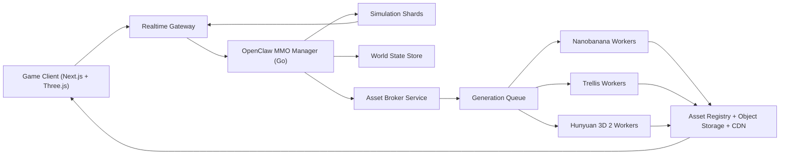

# OpenClaw-Managed MMO Architecture (Adventure RPG Prototype)

## Goal
Build a first-person / third-person adventure MMO where the world is persistent, chunks stream in real time, and new content can be generated in the background without blocking gameplay.

## Core Product Decisions

1. Visual direction: use a **hybrid voxel + stylized mesh/sprite pipeline**.
2. Runtime authority: server authoritative simulation with OpenClaw agent orchestration.
3. Asset pipeline: asynchronous generation with instant placeholder fallback.
4. Persistence: every generated world object and asset is versioned and content-addressed.

## Should It Be Voxel Based?

Recommendation: **voxel-first terrain + hybrid assets**.

1. Terrain and collision: voxel/chunk grid (fast deterministic generation, cheap edits, easy persistence).
2. Props and foliage: mostly 2.5D billboards/imposters for speed.
3. Hero assets (player gear, important NPCs, bosses): 3D meshes with LODs.

Why this mix:

1. Pure generated 3D for everything is too slow and costly for near-real-time chunk streaming.
2. Pure voxel keeps speed high but may feel visually flat.
3. Hybrid gives "Minecraft readability" with sharper painterly style and better production velocity.

## Fastest Asset Strategy (Trellis + Hunyuan 3D 2 + Nanobanana)

Use a tiered runtime policy:

1. Tier 0 (immediate, 0-50 ms): procedural placeholder primitives/voxel kits (never block gameplay).
2. Tier 1 (fast, 0.5-3 s target): 2D concept/sprite/imposter generation with Nanobanana for new discoveries.
3. Tier 2 (slow, 10-120 s+ target): high-quality 3D generation with Trellis/Hunyuan jobs in background queues.
4. Tier 3 (offline polish): moderation + retopology + LOD bake for durable assets.

Runtime rule: every spawned object must be playable at Tier 0 instantly, then hot-swap to Tier 1/2 when available.

## System Architecture

## OpenClaw MMO Manager Responsibilities

1. Own global world directives (events, spawn policy, biome pressure, economy knobs).
2. Route chunk authority to simulation shards.
3. Trigger asset intents when novel entities are encountered.
4. Enforce safety/quality budgets (tokens, generation cost, rate limits).
5. Schedule world-deepening cron jobs and prioritize by active player traffic.

## Chunk Lifecycle (Persistent + Streaming)

1. Player approaches chunk frontier.
2. Server computes deterministic base chunk from seed + coordinates.
3. Server resolves `chunk_manifest` (existing generated assets and variants).
4. Missing assets are replaced by Tier 0 fallback kit and generation intents are queued.
5. Client receives chunk snapshot immediately (no generation blocking).
6. As assets finish, manifest version increments and clients hot-receive patch updates.

## Data Model (Minimum)

1. `world_chunks`: seed, coord, terrain_hash, sim_version, last_active_at.
2. `chunk_entities`: deterministic_id, chunk_id, archetype, state_blob.
3. `asset_intents`: intent_id, semantic_prompt, style_profile, priority, status.
4. `asset_variants`: asset_id, tier, provider, content_hash, lod_meta, moderation_state.
5. `chunk_manifest_versions`: chunk_id, version, referenced_asset_hashes.
6. `npc_minds`: npc_id, loop_state, memory_summary, policy_version.

## NPC AI Loop (Cheap + Stable)

Use finite-state NPC behavior with optional low-cost LLM garnish:

1. Base loop (deterministic): patrol, trade, react, rest.
2. LLM call only on trigger boundaries (dialogue, quest text, unusual world event).
3. Keep hard gameplay outcomes deterministic server-side.
4. Store short rolling memory summaries, not full transcripts.

## Cron World Enrichment

Run scheduled jobs to deepen chunks near active regions:

1. Expand biome variants and landmark density.
2. Upgrade common placeholders into richer Tier 1/2 assets.
3. Rebalance spawn tables from telemetry.
4. Archive low-value generated assets and compact manifests.

## Latency and Cost Guardrails

1. Never put external generation providers on critical path.
2. Hard timeout budgets per tier and provider.
3. Provider fallback routing (if Hunyuan queue is long, issue Nanobanana imposter first).
4. Token/cost quotas enforced per shard and per day.

## Recommended Build Order

1. Ship current hybrid prototype with first/third person and deterministic chunks.
2. Add OpenClaw manager as world-orchestration control plane (no direct rendering concerns).
3. Add asset broker + queue + immutable registry.
4. Introduce hot-swap patch protocol for chunk asset upgrades.
5. Layer in NPC mind loops and cron enrichment.

## Practical Answer To "Quickest Persistent Self-Generating World"

1. Keep world generation deterministic and local to server code.
2. Treat generated assets as asynchronous optional upgrades.
3. Use voxel/procedural fallback kits for immediate playability.
4. Use Nanobanana first for speed, then Trellis/Hunyuan for promoted assets.
5. Persist by chunk manifest versions and content hashes so world state remains stable across sessions.
